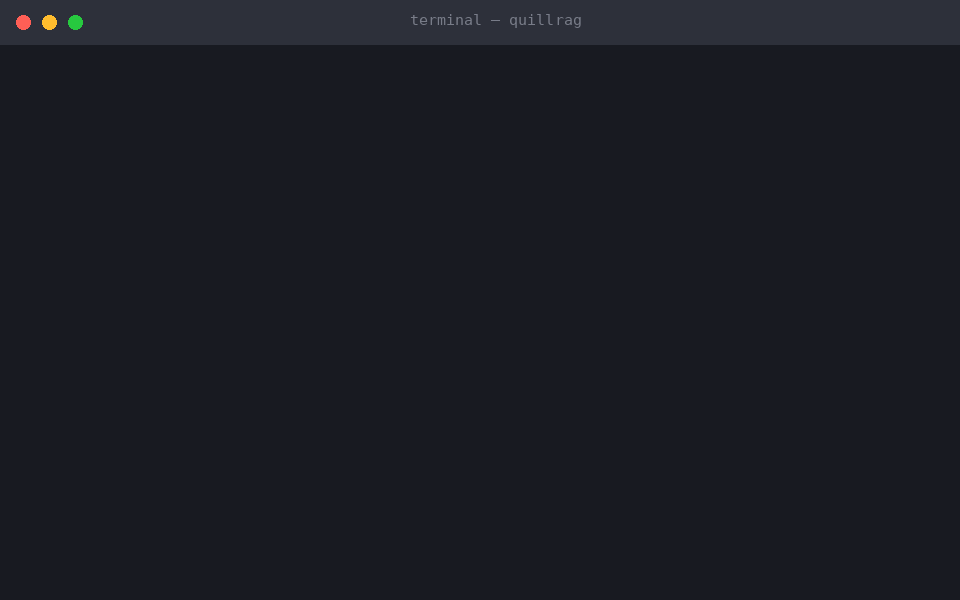

<div align="center">

# quillrag

**One file. Zero dependencies. Ready before your editor finishes loading.**

A local RAG engine in a single static binary — MiniLM embeddings compiled
inside, hybrid dense + BM25 retrieval, MCP-native. No Node, no Python,
no model download on first query.

[](https://github.com/Ayush-yadav11/quillrag/releases/latest)
[](https://github.com/Ayush-yadav11/quillrag/releases/latest)
[](LICENSE)



</div>

---

## Why quillrag

| | |
|---|---|
| **~20 ms to ready** | MCP handshake completes before the model even loads |
| **Zero runtime deps** | no Node, no Python, no pip/npm, no model downloads — ever |
| **Hybrid retrieval** | dense cosine ⊕ BM25 fused with Reciprocal Rank Fusion |
| **Private by construction** | no network code path after installation |
| **One file, three OSes** | ~105 MB (the model lives inside), CI-built for linux/macOS/Windows |

## Quick start

```sh
# 1. grab a prebuilt binary (or cargo install --path .)
gh release download --repo Ayush-yadav11/quillrag -p '*linux*'
tar xzf quillrag-x86_64-linux.tar.gz && chmod +x quillrag

# 2. point it at any folder of notes/docs/code
./quillrag index ~/notes          # incremental walk

# 3. ask it something
./quillrag search "how does backpropagation work"
```

Or wire it straight into Claude Desktop / Cursor and let the AI search your
notes mid-conversation — config below.

```
$ ./quillrag serve --data-dir ~/.local/share/quillrag
2026-08-26 INFO quillrag 0.1.2 ready in 41ms      <- handshake-ready before the model loads
```

## Why it's fast

| Stage | Cost |
|---|---|
| Binary start + MCP initialize | **~20 ms** (measured: store open + tool registration only) |
| First `rag_search` / `rag_index` call | +~300 ms one-time (mmap safetensors, build BERT graph) |
| Subsequent searches | **~25 ms** per query (2-core CPU, small corpus) |
| Re-indexing unchanged corpus | near-zero (FNV content hash skip) |

The embedding model is *lazy*: the MCP handshake and `rag_status` never touch
it, so editors see an instant server.

## Install

Download a prebuilt archive from the [latest release](https://github.com/Ayush-yadav11/quillrag/releases/latest)
— Windows x86_64, macOS Apple Silicon, and Linux x86_64 are all built by CI on
every version tag:

```sh
# linux/macOS example: fetch + extract the latest release
gh release download --repo Ayush-yadav11/quillrag -p '*linux*' | tar xz
chmod +x quillrag && ./quillrag --version
```

Or build from source:

```sh
cargo install --path .
```

Cross-compile targets used by CI: `x86_64-unknown-linux-gnu`,
`aarch64-apple-darwin`, `x86_64-pc-windows-msvc`.

## Wire it into your editor

Claude Desktop / Cursor / any MCP client:

```json
{
  "mcpServers": {
    "quillrag": {
      "command": "/usr/local/bin/quillrag",
      "args": ["serve"],
      "env": { "QUILLRAG_DATA": "~/.local/share/quillrag" }
    }
  }
}
```

Or just run `./quillrag serve` and point any stdio client at it.

## Tools

| Tool | What it does |
|---|---|
| `rag_index`  | Incrementally index a directory/file. Skips unchanged files, prunes deleted ones, re-embeds only diffs. |
| `rag_search` | Hybrid retrieval: dense MiniLM cosine + BM25 keyword, fused with Reciprocal Rank Fusion. Returns ranked chunks with source paths. |
| `rag_status` | Document/chunk counts, bytes indexed, file-type breakdown. |
| `rag_clear`  | Wipe everything. |

CLI equivalents (same engine):

```sh
quillrag index ~/notes              # incremental walk
quillrag search "auth flow" -k 5    # one-shot search
quillrag status                     # stats
quillrag clear                      # wipe
```

## Design

- **Embeddings**: [candle](https://github.com/huggingface/candle) (pure Rust)
  running `sentence-transformers/all-MiniLM-L6-v2` — masked mean pooling +
  L2 norm, numerically matching sentence-transformers on CPU. Weights are
  `include_bytes!`-ed into the binary and mmap'd from a materialized cache on
  first load.
- **Storage**: single [redb](https://github.com/cberner/redb) file — chunk text,
  raw f32 vectors, document metadata. Atomic commits; crash-safe.
- **Keywords**: [tantivy](https://github.com/quickwit-inc/tantivy) BM25 sidecar
  index rebuilt per indexing pass (cheap at pocket scale).
- **Fusion**: Reciprocal Rank Fusion (`Σ 1/(60+rank)`) — no score-scale tuning,
  robust to heterogeneous rankings.
- **Chunking**: paragraph-first with 1000-char cap and 120-char overlap;
  oversized paragraphs hard-split at sentence boundaries.

### File types indexed by default
`md markdown txt rst json yaml yml toml csv tsv html htm xml log rs py js jsx ts
tsx go c h cpp hpp java rb sh bash zsh sql proto graphql dockerfile makefile ini
cfg conf env` — extend with `-e ext1,ext2` / `"extensions": [...]`.

Ignored dirs: **every dot-directory** (`.git .obsidian .vscode …`) plus
`node_modules target dist build venv __pycache__ vendor`.

## Privacy & footprint

Everything runs locally: embeddings, storage, search. Nothing leaves the
machine — there is no network code path at all after installation.

Binary ≈ 105 MB (the model lives inside). RAM ≈ 120 MB resident while idle,
spiking to ~250 MB during batch embedding.

## Scaling & limits

quillrag stores everything in a single `redb` file and runs dense retrieval as
an **exact, single-threaded linear scan over all vectors** — no ANN index yet.
That makes the relevant limit *query latency*, not storage. Storage scales to
millions of chunks; retrieval speed is O(N) per query.

| Corpus | Vectors | Approx. RAM (f32) | Steady-state query |
|---|---|---|---|
| 1K chunks | 1K | ~1.5 MB | **~25 ms** (measured) |
| 10K chunks | 10K | ~15 MB | ~250 ms (extrapolated) |
| 100K chunks | 100K | ~154 MB | ~2–5 s (extrapolated) |
| 1M chunks | 1M | ~1.5 GB | 20–60 s (extrapolated — not viable without ANN) |

**Verified on a corpus of 1K chunks (5/5 tests including real JSON-RPC-over-stdio
e2e); figures above 1K are extrapolated from the O(N) dense-scan cost, not
measured.** A synthetic scale probe (`src/bin/quillbench.rs`) exists to measure
the curve on your own hardware — run `cargo build --release && ./target/release/quillbench`.

What this means in practice:

- **Great fit:** personal/local knowledge bases, project docs, notes, code —
  up to low-tens-of-thousands of chunks where sub-second-to-interactive latency
  holds.
- **Away from the sweet spot:** corpora in the hundreds of thousands+ where you
  need interactive (<200 ms) retrieval — you'll want an ANN index (see Roadmap).

How it compares to common alternatives on the *relevance* axis:

- **Embedding-only (e.g. raw FAISS flat / simple vector store):** same
  `all-MiniLM-L6-v2` ceiling as quillrag's dense path, but quillrag adds BM25 +
  RRF fusion, which wins on keyword-heavy queries (error codes, IDs, exact
  tokens). quillrag has no reranker or metadata filtering, which llama-index
  offers on top.
- **llama-index local backends:** functionally similar hybrid retrieval
  (BM25 + vector + RRF). quillrag trades llama-index's rich reranking/parent-child
  chunking/query-expansion for a zero-dependency single binary and instant
  startup. Relevance on a standard dataset (BEIR/MS MARCO) is **not yet
  benchmarked** — see the open issue tracking ANN + a relevance baseline.

## Roadmap

quillrag is deliberately minimal today. The big unlock is an **approximate
nearest-neighbor index**:

- **ANN (HNSW / IVF) over the dense vectors** — turns O(N) scan into
  sub-millisecond ANN lookup, pushing the interactive ceiling from ~10K to
  millions of chunks on a single machine.
- **Quantization (PQ / SQ)** — drops vector RAM from 4 bytes/dim to ~1 byte/dim,
  so 1M chunks ≈ 380 MB instead of 1.5 GB.
- **Multi-threaded scan** — parallelize the current exact path as a stopgap.
- **Reranker hook** — optional cross-encoder rerank of the fused top-k.
- **Relevance benchmark** — BEIR / MS MARCO nDCG@10 vs. llama-index baselines.

Track the ANN work here: **issue #1 — "ANN index for <1M chunks."**

## FAQ

**Is it really one file?** Yes. The MiniLM weights + tokenizer are compiled in
via `include_bytes!`. No `npm install`, no Python, no model download on first
query. The binary is ~105 MB because the model lives inside it.

**Why is startup so fast?** The embedding model is *lazy*. The MCP handshake and
`rag_status` never touch it — editors see a ready server in ~20 ms. The model
only loads on the first `rag_search` / `rag_index` (~300 ms one-time).

**What's the largest corpus it handles?** Verified at 1K chunks (~25 ms/query).
The architecture scales to millions of stored chunks; interactive retrieval
holds up to low-tens-of-thousands today, and an ANN index (Roadmap) extends that
to 1M+.

**How is this different from llama-index?** Similar hybrid retrieval quality, but
quillrag is a single static binary with no runtime/dependency footprint and
instant startup. llama-index adds rerankers, sophisticated chunking, and query
expansion that quillrag doesn't have yet.

**What file types are indexed?** `md markdown txt rst json yaml yml toml csv
tsv html htm xml log rs py js jsx ts tsx go c h cpp hpp java rb sh bash zsh sql
proto graphql dockerfile makefile ini cfg conf env` — extend with `-e`.

**Does it phone home?** No. There is no network code path after installation.

## Changelog

- **v0.1.3** — MCP tool descriptions rewritten for clarity, parameter semantics,
  and behavioral transparency (read-only/destructive flags, usage guidance);
  server.json shipped in-repo for MCP Registry publishing.
- **v0.1.2** — skip all dot-directories when indexing (`.obsidian` plugin configs
  no longer pollute results); first fully automated 3-platform CI release.
  *Upgrade note:* run `quillrag clear` once and re-index.
- **v0.1.1** — CI-built release artifacts for linux/macos/windows with checksums.
- **v0.1.0** — initial public release; renamed from pocketrag.

## Development

```sh
cargo test                    # unit + end-to-end (spawns real stdio servers)
cargo run -- serve            # dev server
RUST_LOG=debug cargo run ...  # verbose logs (stderr only)
```

License: MIT
